**Semaine du 11 Juin 2021**

**Objectif principal:** Proposer un module d'interface permettant d'afficher des résultats de simulation FPGA sur un oscilloscope de laboratoire à l'aide d'un DAC connecté à une carte Genesys2 pour l'obtention de métriques.

**Objectifs de la semaine:**  

- Développement d'une solution simple d'envoi de données (4 canaux de 16bits depuis la Genesys2 vers le DAC), essais avec oscilloscope.

**Ressources consultées:** 
- [FMC Standard (.pdf)](https://forums.xilinx.com/xlnx/attachments/xlnx/cn-7series/3476/1/FMC_Standard.pdf)
- [TI Precision Labs - LVDS: What is LVDS? (YouTube)](https://www.youtube.com/watch?v=nnggsse6AO8)
- [Define Ports as LVDS (web)](https://forums.xilinx.com/t5/Implementation/Define-ports-as-LVDS/td-p/841324)
- [7 Series FPGAs SelectIO Resources (.pdf)](https://www.xilinx.com/support/documentation/user_guides/ug471_7Series_SelectIO.pdf)
- [Kintex-7 Data Sheet: DC and AC Switching Characteristics (.pdf)](https://www.xilinx.com/support/documentation/data_sheets/ds182_Kintex_7_Data_Sheet.pdf)
- [DAC348x Device Configuration and Synchronization (.pdf)](https://www.ti.com/lit/an/slaa584/slaa584.pdf?ts=1623100088349&ref_url=https%253A%252F%252Fwww.google.com%252F)
- [Genesys2 Schematic (.pdf)](https://reference.digilentinc.com/_media/genesys2:genesys2_public_sch.pdf)
- [LVCMOS25 Standard for LVDS (web)](https://forums.xilinx.com/t5/Other-FPGA-Architecture/Using-Lvcmos25-standard-for-LVDS-input-from-ADC/td-p/827994)
- [ZC706 Schematic (.pdf via Xilinx)](https://www.xilinx.com/member/forms/download/design-license.html?cid=396436&filename=zc706-schematic-xtp215.zip)
- [Voltage-controlled Oscillator VCO (web)](https://en.wikipedia.org/wiki/Voltage-controlled_oscillator)
- [CDCE62005 Data Sheet (.pdf)](https://www.ti.com/lit/ds/symlink/cdce62005.pdf?ts=1623332685962&ref_url=https%253A%252F%252Fwww.google.com%252F)

**Tâches effectuées 07 Juin 2021**
- Lecture de la documentation [FMC Standard (.pdf)](https://forums.xilinx.com/xlnx/attachments/xlnx/cn-7series/3476/1/FMC_Standard.pdf). Selon la [datasheet](https://www.ti.com/lit/ds/symlink/dac3484.pdf?ts=1622839791160&ref_url=https%253A%252F%252Fwww.google.com%252F) du DAC3484 (microcontrôleur), le DAC fonctionne avec seulement les entrées LVDS D[0-15]P/N, ce qui correspond avec l'entrée 16bits LVDS comme indiquée sur la page du microcontrôleur.
- Selon sa [datasheet](../docs/FMC-DAC-ADAPTER_SCH_D.pdf), l'adaptateur FMC-DAC n'exploite pas les 400 pins (High Pin Count) de la spécification FMC mais plutôt les 160 pins (Low Pin Count). Une grande partie des pins sont donc inutilisés par l'adaptateur. On suppose que puisque seulement 160 pins sont utilisées, les pins correspondantes à D[0-15]P/N sont les pins *fmc_la_p/n[0-15]* décrits dans le [fichier de contrainte](../xdc/default.xdc) de base de la Genesys2.

Supposition:

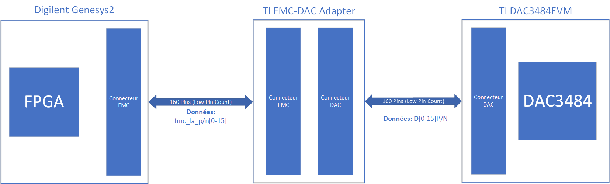

- Exploitation du document [DAC348x Device Configuration and Synchronization (.pdf)](https://www.ti.com/lit/an/slaa584/slaa584.pdf?ts=1623100088349&ref_url=https%253A%252F%252Fwww.google.com%252F) pour comprendre l'utilisation du DAC3484 embarqué sur le DAC3484EVM. La configuration du DAC3484EVM implique l'utilisation d'un logiciel fourni par Texas Instruments, permettant de facilement créer un fichier de programmation sous format HEX qui peut être téléversé sur le DAC3484 via USB.

**Tâches effectuées 08 Juin 2021**

- Après étude de la documentation de la Genesys2 et du DAC3484EVM / FMC-DAC adapter, il semblerait que la Genesys2 ne dispose pas des pins FMC nécessaires au DAC3484EVM. Le DAC3484EVM prend en entrée des paires différentielles (LVDS) et les PINs FMC de la Genesys2 ne permettent pas des sorties différentielles (seulement LVCMOS12, ne pouvant pas être converti en LVDS). La décision temporaire est d'utiliser la carte ZC706 qui permet l'utilisation de LVDS_25 sur ses PINs FMC LVCMOS25.

**NOTE:** Pour alimenter correctement le DAC avec le PSU de laboratoire, un courant de 0.5A est nécessaire pour 6.9V.

**Tâches effectuées 09 Juin 2021**
- Définition de la table de correspondance des PINs LPC de la ZC706 pour compatibilité avec FMC-DAC ADAPTER et DAC3484EVM. Le nom des signaux correspondent aux entrées du SoC DAC3484 présent sur le DAC3484EVM.

**Table de correspondance des PINs ZC706 / FMC-DAC ADAPTER / DAC3484**

|NOM     |ZC706             ||FMC-DAC|DAC3484||NOM     |ZC706             ||FMC-DAC|DAC3484|
|--------|------------------|------|-------|-------|------|--------|------------------|------|-------|-------|
|D0P     |FMC_LPC_LA24_P    |      |H28    |163    |      |D10P    |FMC_LPC_LA29_P    |      |G30    |97     |
|D0N     |FMC_LPC_LA24_N    |      |H29    |165    |      |D10N    |FMC_LPC_LA29_N    |      |G31    |99     |
|D1P     |FMC_LPC_LA21_P    |      |H25    |157    |      |D11P    |FMC_LPC_LA25_P    |      |G27    |91     |
|D1N     |FMC_LPC_LA21_N    |      |H26    |159    |      |D11N    |FMC_LPC_LA25_N    |      |G28    |93     |
|D2P     |FMC_LPC_LA19_P    |      |H22    |151    |      |D12P    |FMC_LPC_LA22_P    |      |G24    |85     |
|D2N     |FMC_LPC_LA19_N    |      |H23    |153    |      |D12N    |FMC_LPC_LA22_N    |      |G25    |87     |
|D3P     |FMC_LPC_LA15_P    |      |H19    |145    |      |D13P    |FMC_LPC_LA20_P    |      |G21    |79     |
|D3N     |FMC_LPC_LA15_N    |      |H20    |147    |      |D13N    |FMC_LPC_LA20_N    |      |G22    |81     |
|D4P     |FMC_LPC_LA11_P    |      |H16    |139    |      |D14P    |FMC_LPC_LA16_P    |      |G18    |73     |
|D4N     |FMC_LPC_LA11_N    |      |H17    |141    |      |D14N    |FMC_LPC_LA16_N    |      |G19    |75     |
|D5P     |FMC_LPC_LA07_P    |      |H13    |133    |      |D15P    |FMC_LPC_LA12_P    |      |G15    |67     |
|D5N     |FMC_LPC_LA07_N    |      |H14    |135    |      |D15N    |FMC_LPC_LA12_N    |      |G16    |69     |
|D6P     |FMC_LPC_LA04_P    |      |H10    |127    |      |SYNCP   |FMC_LPC_LA30_P    |      |H34    |175    |
|D6N     |FMC_LPC_LA04_N    |      |H11    |129    |      |SYNCN   |FMC_LPC_LA30_N    |      |H35    |177    |
|D7P     |FMC_LPC_LA02_P    |      |H7     |121    |      |PARITYP |FMC_LPC_LA28_P    |      |H31    |170    |
|D7N     |FMC_LPC_LA02_N    |      |H8     |123    |      |PARITYN |FMC_LPC_LA28_N    |      |H32    |172    |
|D8P     |FMC_LPC_LA33_P    |      |G36    |109    |      |FRAMEP  |FMC_LPC_LA32_P    |      |H37    |156    |
|D8N     |FMC_LPC_LA33_N    |      |G37    |111    |      |FRAMEN  |FMC_LPC_LA32_N    |      |H38    |158    |
|D9P     |FMC_LPC_LA31_P    |      |G33    |103    |      |DATACLKP|FMC_LPC_LA18_CC_P|      |C22     |115     |
|D9N     |FMC_LPC_LA31_N    |      |G34    |105    |      |DATACLKN|FMC_LPC_LA18_CC_N|      |C23     |117     |

\
**IOs du DAC3484 de Texas Instruments, détails dans DAC3484 Schematic**\
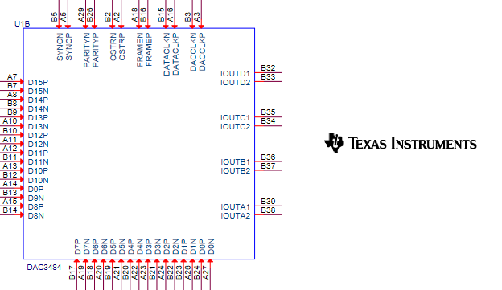

- Création d'un programme de compteur en valeurs signéees (complément à deux) pour téléverser des données sur le port LPC de la ZC706 vers le DAC3484EVM. Le but espéré est d'obtenir une courbe en triangle sur l'oscilloscope. Il faut désormais identifier le protocole de synchronisation à utiliser entre le FPGA et le DAC3484. Les FIFOs présentes sur le DAC3484 (SoC) doivent être synchronisées avec une horloge (plusieurs possiblités de génération, J9 du DAC3484EVM, via FPGA, via CDCE62005 du DAC3484EVM). Le choix est d'émettre une horloge contrôlée par le FPGA.

**Tâches effectuées 10 Juin 2021**

- Grâce au tableau de correspondance des PINs ZC706 / FMC-DAC ADAPTER / DAC3484, la supposition précédente est complètement écartée. Les PINs DATACLK_P/N sont aussi corrigés. La nomenclature est différente entre le FMC-DAC ADAPTER et le DAC3484. Ces PINs sont importants pour la synchronisation des données en entrée.
- L'horloge interne du FPGA de la ZC706 est utilisée comme horloge dirigeant les PINs précédemment évoqués. Il est nécessaire d'utiliser des IBUFDS de la librairie UNISIM pour pouvoir diriger les ports différentiels. Un premier programme décrivant un compteur simple dirigé par l'horloge interne du FPGA donne comme résultat une courbe en dent-de-scie, ce compteur monte à une valeur maximale quelconque puis retombe à 0.
- Un second programme comptant de -32768 (valeur minimale sur 16 bits signés en complément à deux) à 32767 puis se décrémentant par la suite jusqu'à -32768 avant de répéter indéfiniment ce cycle donne une courbe sinusoidale. Il est à noter que plusieurs connectiques de mesures sont utilisées. En comparant les résultats obtenus avec la probe et un câble BNC mâle - SMA mâle, des différences sont identifiées:\
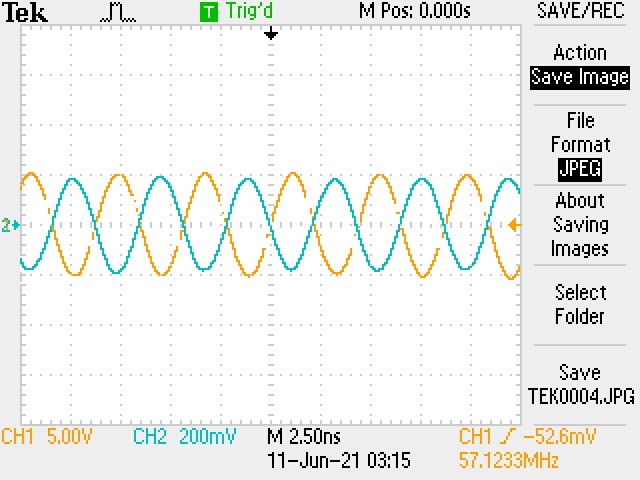\
Les deux courbes semblent inversées. La différence de matériel est sûrement la raison de cette inversion. Par la suite, les mesures sont effectuées avec le BNC-SMA uniquement.
- En utilisant uniquement le BNC-SMA on note des irrégularités dans les valeurs de tension d'un même signal. Le signal n'est pas très stable, on observe les fluctuations suivantes, sur le même signal, sur le même port de sortie et avec le même câble:\
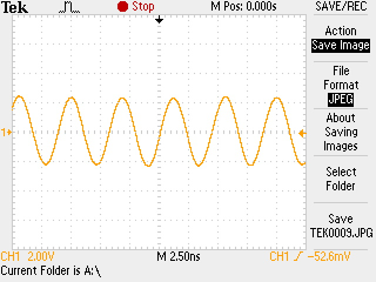\
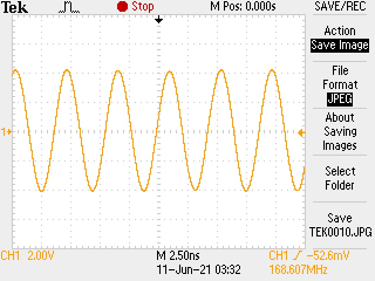\
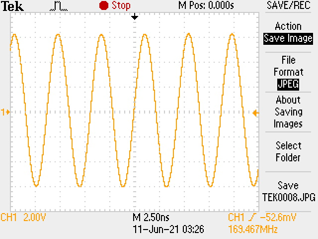\
La plage de tension est de [-6V, -4V, -2V, 2V, 4V, 6V]. Il est nécessaire d'effectuer des recherches supplémentaires sur la raison de ces différences.\
De tels résultats sont obtenus avec une paramétrisation bien précise du DAC3484EVM à l'aide de l'interface graphique offerte par Texas Instruments:\
**Onglet INPUT**\
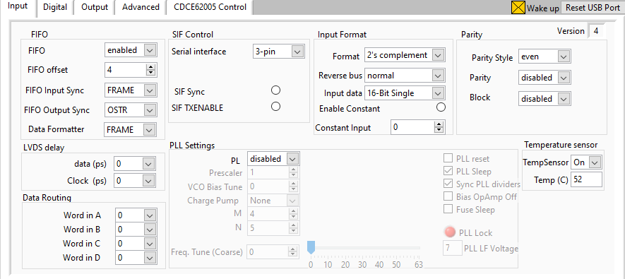\
**Onglet DIGITAL**\
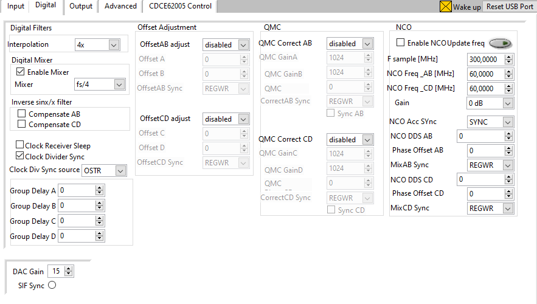\
**Onglet OUTPUT**\
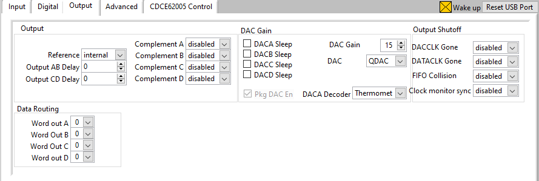\
**Onglet ADVANCED**\
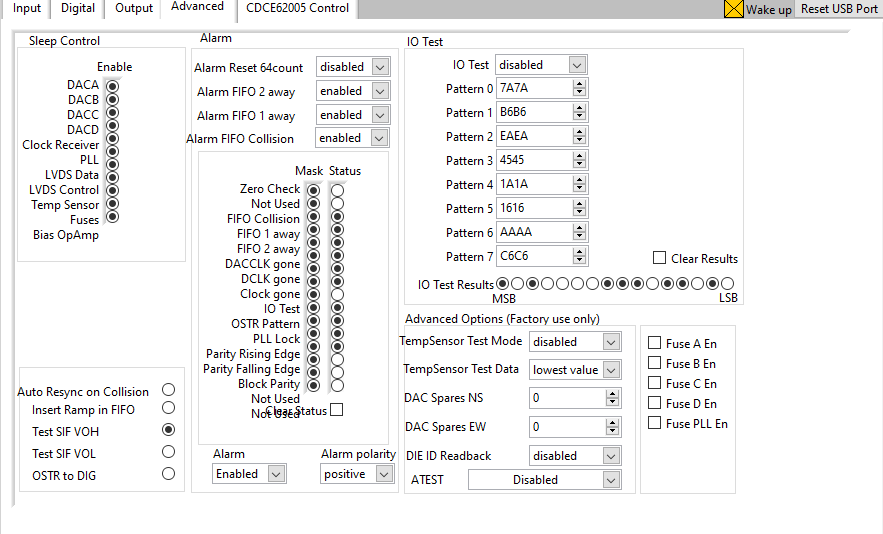\
**Onglet CDCE62005**\
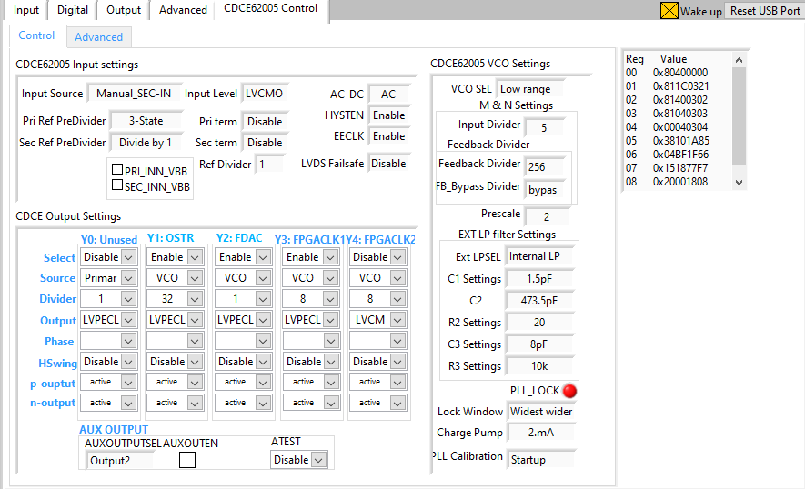\
**NOTE:** Le Digital Mixer de l'onglet DIGITAL permet d'obtenir une courbe plus exploitable, sans quoi la courbe est relativement parasitée par des bruits/instable/difficile à exploiter.
- Les prochaines tâches à effectuer sont la traduction de la conception via System Generator (Matlab) pour le logiciel Vivado. Par la suite, il faut empaqueter l'interface produite pour produire un assemblage comprenant les deux conceptions (via System Generator, générant des signaux devant être convertis par le DAC et le module interface avec le DAC).

**Tâches effectuées 11 Juin 2021**

- Après consultation du document [CDCE62005 Data Sheet](https://www.ti.com/lit/ds/symlink/cdce62005.pdf?ts=1623332685962&ref_url=https%253A%252F%252Fwww.google.com%252F), il semble qu'en sélectionnant comme source d'horloge pour le DAC le Voltage-controlled Oscillator (VCO), la fréquence du DAC produit des anomalies visuelles sur le signal affiché sur l'oscilloscope.\
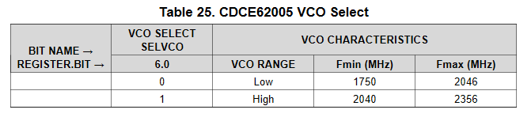\
En fonction de la portée (Range) choisie, la fréquence maximale et minimale du VCO varie.

Le protocole de communication entre le FPGA et le DAC n'est pas respecté pour le moment. Certains signaux de contrôles ont été omis.

| NOM | ROLE |
|-----|------|
|SYNC | Permet de synchroniser le reset des pointeurs de lecture / ériture des FIFOs. |
|SIF_SYNC| Signal ne déependant ni de DATACLK ni de DACCLK. Il permet à un FPGA avec un nombre limité de PINs de déléguer la responsabilité de synchronisation au registre SPI.|
|ISTR/FRAME| Permet d'identifier un nouvel échantillon (voir [page 12](https://www.ti.com/lit/an/slaa584/slaa584.pdf?ts=1623100088349&ref_url=https%253A%252F%252Fwww.google.com%252F))|
