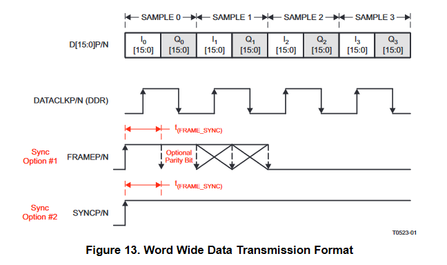
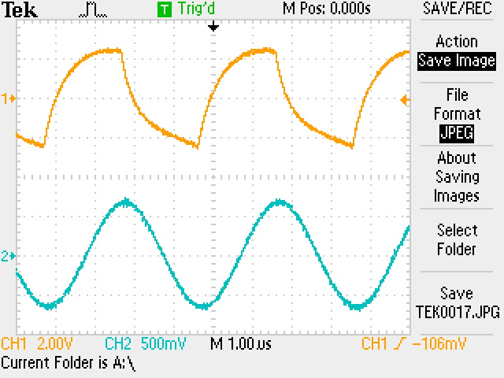
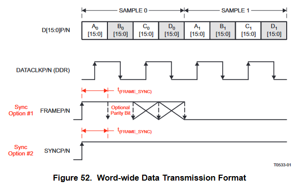
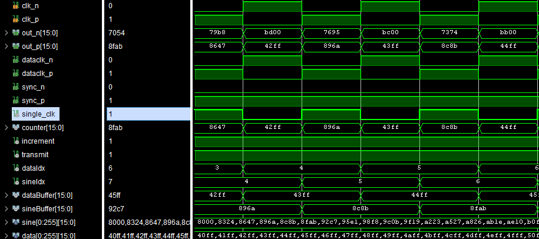
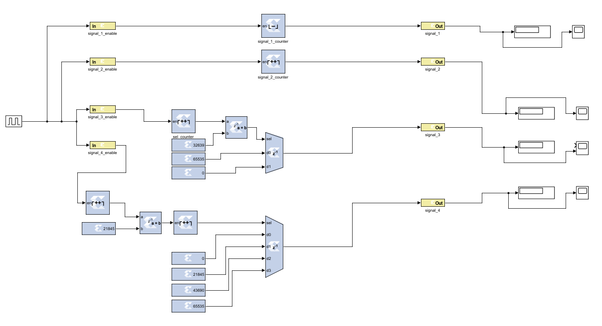
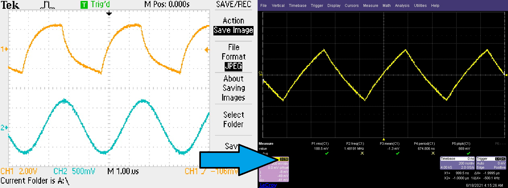

**Semaine du 18 Juin 2021**

**Objectif principal:** Proposer un module d'interface permettant d'afficher des résultats de simulation FPGA sur un oscilloscope de laboratoire à l'aide d'un DAC connecté à une carte Genesys2 pour l'obtention de métriques.

**Objectifs de la semaine:** Respect du protocole de communication entre le DAC3484EVM et le FPGA pour proposer une interface fonctionnelle. Intégration d'un design System Generator sur Vivado pour une plateforme de convertion DAC.

**Schémas techniques:**
- [FMC-DAC Adapter](../docs/FMC-DAC-ADAPTER_SCH_D.pdf)
- [DAC3484EVM](../docs/DAC348XEVM-SCH_H.pdf)

**Ressources consultées:** 
- [Saw tooth with DAC3484EVM and ZedBoard (web)]([lien](https://e2e.ti.com/support/data-converters-group/data-converters/f/data-converters-forum/439065/saw-tooth-with-dac3484evm-and-zedboard?tisearch=e2e-sitesearch&keymatch=DAC3484EVM#))
- [DAC3484 Quad-Channel User's Guide](https://www.ti.com/lit/ds/symlink/dac3484.pdf?ts=1623764933105&ref_url=https%253A%252F%252Fwww.ti.com%252Fproduct%252FDAC3484)

**Glossaire**
| | |
|-|-|
| **SIF** | Signal Input Format |
| **PLL** | Phase-Locked Loop |
| **NCO** | Numerically-Controlled Oscillator |
| **DDR** | Double Data Rate (transmission de donnée sur les deux fronts d'horloge) |

**Tâches effectuées 14 Juin 2021**\
Tableau descritpif des signaux de contrôle du DAC3484:
| NOM | ROLE |
|-----|------|
|SYNC | Permet de synchroniser le reset des pointeurs de lecture / ériture des FIFOs. |
|SIF_SYNC| Signal ne déependant ni de DATACLK ni de DACCLK. Il permet à un FPGA avec un nombre limité de PINs de déléguer la responsabilité de synchronisation au registre SPI.|
|ISTR/FRAME| Permet d'identifier un nouvel échantillon (voir [page 12](https://www.ti.com/lit/an/slaa584/slaa584.pdf?ts=1623100088349&ref_url=https%253A%252F%252Fwww.google.com%252F))|
| DATACLK | Signal d'horloge pour les données entrantes dans le DAC |

Le DAC3484 avec des entrées 16bits fonctionne en mode Word Wide Data tel que décrit sur la figure ci dessous.

Les sources de synchronisation pour chaque composant du DAC3484 sont les suivantes:

**Tâches effectuées 15 Juin 2021**
- **TRANSMISSION DE PLUSIEURS SIGNAUX EN SIMULTANÉ VERS LE DAC3484EVM** 
\
Réalisation d'un code VHDL permettant de transmettre en simultané deux signaux différents. Dans le cadre du code, un signal sinusoidal et un signal triangulaire sont transmis.\
\
Pour permettre le transfert en "simultané" de ces deux signaux, le principe de **DDR** est exploité. Tel que discuté dans le [guide utilisateur](https://www.ti.com/lit/ds/symlink/dac3484.pdf?ts=1623764933105&ref_url=https%253A%252F%252Fwww.ti.com%252Fproduct%252FDAC3484) page 31, pour chaque canal de données (A, B, C et D), les deux fronts d'horloge sont exploités.\
\
Un cycle complet de transmission est défini par deux périodes P1 et P2. Au front montant de P1, les données D[15:0]N/P sont chargées pour le canal A. Au front descendant de P1, c'est le canal B qui est chargé. Par la suite, au front montant de P2, le canal C est chargé et au front descendant de P2 c'est au tour du canal D.\
Les différents canaux, à la fin d'un cycle complet, disposent d'un échantillon à traiter. Le prochain ensemble d'échantillons est chargé de la même manière. Sur la capture d'écran d'oscilloscope, seulement deux canaux sont exploités.\
\
Le [code HDL](../workspace/zc706_dac/zc706_dac.srcs/sources_1/new/ddr_main.vhd) exploite les modèles de registres ODDR fournis par Vivado pour implémenter cette fonctionnalité. Deux registres tampons, dataBuffer et sineBuffer sont utilisés pour charger les données devant être exploitées par les registres ODDR. Ces tampons sont présents à cause de la limitation technique imposée au moment de la génération des registres ODDR.\
\
Le résultat de la simulation ci dessus permet d'observer le chargement aux deux fronts d'horloge des deux registres tampons. Le contenu de ces registres est dirigé vers la sortie **counter** une période suivant le chargement de ces mêmes registres.

**Tâches effectuées 16 Juin 2021**
- **COUPLAGE DU MODÈLE DÉVELOPPÉ SUR SYSTEM GENERATOR ET DU CODE HDL**
\
Débuts sur System Generator, construction d'un modèle simple. Construction d'un modèle plus complexe pour générer 4 formes d'ondes différentes:\
\
Ce modèle a par la suite été intégré dans un environnement de développement Vivado. System Generator permet de générer un paquet IP utilisable par Vivado. On peut ensuite déclarer une instance de cet IP dans un code VHDL standard.

**Tâches effectuées 16 Juin 2021**
- Collaboration avec Hossein Chalangar (candidat PhD) sur l'utilisation du DAC3484EVM pour l'obtention de résultats exploitables à intégrer dans un papier, tel qu'exigé lors de l'évaluation par les pairs. Prise de décision sur l'interface commune à partager entre le design System Generator et le design FPGA permettant de transcrire des résultats sur un oscilloscope.
- Utilisation d'un modèle plus avancé d'oscilloscope. Modification de la capacité résistive du signal dans le but d'obtenir un signal plus propre. Les nouveaux paramètres du DAC sont disponibles dans le dossier **dac_configs** pour ce modèle particulier d'oscilloscope [LeCroy WaveSurfer 422](https://www.testequipmenthq.com/datasheets/LECROY-WAVESURFER%20422-Datasheet.pdf).
- Le nettoyage du signal permet l'obtention d'un signal beaucoup plus proche du résultat attendu. La forme triangulaire est plus perceptible. À gauche le résultat obtenu avec le Tektronix TDS 2024C:\
\
Au délà des paramètres différents de l'oscilloscope LeCroy, la fréquence de fonctionnement du DAC et du FPGA a été augmentée, permettant l'obtention de résultats plus significatifs sur les deux modèles d'oscilloscopes.