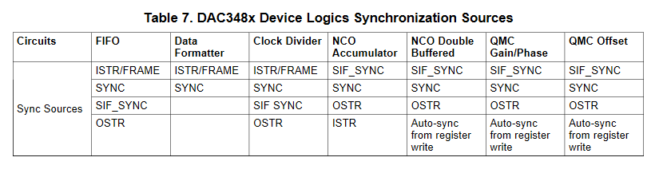

**Semaine du 18 Juin 2021**

**Objectif principal:** Proposer un module d'interface permettant d'afficher des résultats de simulation FPGA sur un oscilloscope de laboratoire à l'aide d'un DAC connecté à une carte Genesys2 pour l'obtention de métriques.

**Objectifs de la semaine:** Respect du protocole de communication entre le DAC3484EVM et le FPGA pour proposer une interface fonctionnelle. Intégration d'un design System Generator sur Vivado pour une plateforme de convertion DAC.

**Schémas techniques:**
- [FMC-DAC Adapter](../docs/FMC-DAC-ADAPTER_SCH_D.pdf)
- [DAC3484EVM](../docs/DAC348XEVM-SCH_H.pdf)

**Ressources consultées:** 
- [Saw tooth with DAC3484EVM and ZedBoard (web)]([lien](https://e2e.ti.com/support/data-converters-group/data-converters/f/data-converters-forum/439065/saw-tooth-with-dac3484evm-and-zedboard?tisearch=e2e-sitesearch&keymatch=DAC3484EVM#))

**Glossaire**
| | |
|-|-|
| **SIF** | Signal Input Format |
| **PLL** | Phase-Locked Loop |
| **NCO** | Numerically-Controlled Oscillator |

**Tâches effectuées 14 Juin 2021**\
Tableau descritpif des signaux de contrôle du DAC3484:
| NOM | ROLE |
|-----|------|
|SYNC | Permet de synchroniser le reset des pointeurs de lecture / ériture des FIFOs. |
|SIF_SYNC| Signal ne déependant ni de DATACLK ni de DACCLK. Il permet à un FPGA avec un nombre limité de PINs de déléguer la responsabilité de synchronisation au registre SPI.|
|ISTR/FRAME| Permet d'identifier un nouvel échantillon (voir [page 12](https://www.ti.com/lit/an/slaa584/slaa584.pdf?ts=1623100088349&ref_url=https%253A%252F%252Fwww.google.com%252F))|
| DATACLK | Signal d'horloge pour les données entrantes dans le DAC |

Le DAC3484 avec des entrées 16bits fonctionne en mode Word Wide Data tel que décrit sur la figure ci dessous.

Les sources de synchronisation pour chaque composant du DAC3484 sont les suivantes:
