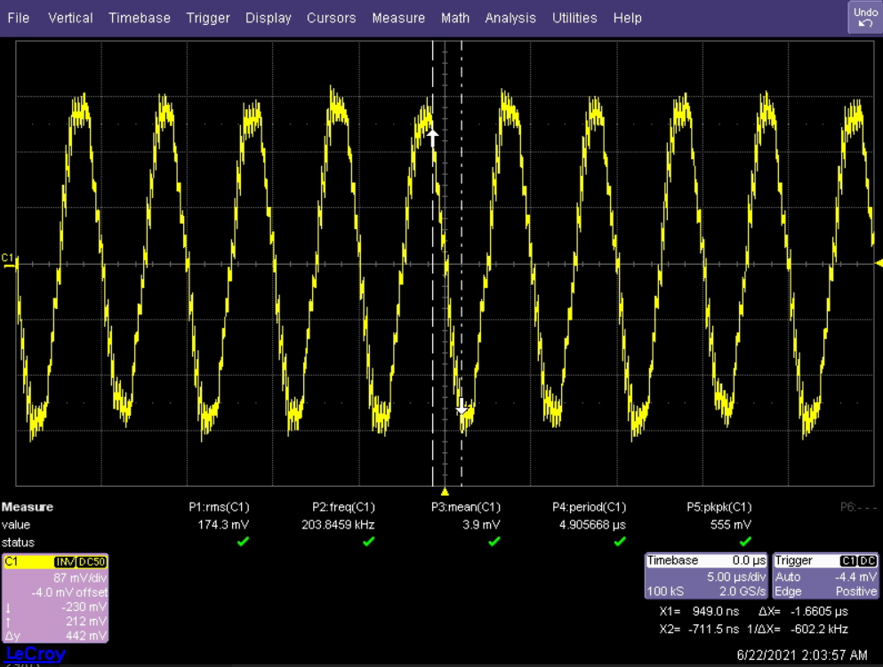
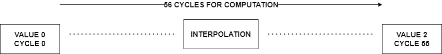

**Semaine du 25 Juin 2021**

**Objectif principal:** Proposer un module d'interface permettant d'afficher des résultats de simulation FPGA sur un oscilloscope de laboratoire à l'aide d'un DAC connecté à une carte Genesys2 pour l'obtention de métriques.

**Objectifs de la semaine:** Finaliser l'interface entre le modèle System Generator et le DAC3484. Obtention de captures d'écrans pour la publication scientifique.

**Schémas techniques:**
- [FMC-DAC Adapter](../docs/FMC-DAC-ADAPTER_SCH_D.pdf)
- [DAC3484EVM](../docs/DAC348XEVM-SCH_H.pdf)

**Glossaire**
| | |
|-|-|
| **mot** | signification |
| | |

**Tâches effectuées 21 Juin**
- Intégration du design de Hossein (System Generator) vers un projet Vivado. Exploration de solutions pour améliorer la qualité du signal. On observe un effet d'escalier sur le signal tel que:\
\
Il est à noter que le workflow SystemGenerator -> Vivado nécessite beaucoup de temps dédié à la compilation du modèle SystemGenerator en IP Vivado et à la génération du bitstream. Un processeur plus puissant pourrait peut-être remédier à ce problème.

**Tâches effectuées 22 Juin 2021**
- Selon Pr. Tarek Ould-Bachir, l'effet d'escalier du signal étudié la veille est dû à la période de 175ns. On remarque en effet que les escaliers coincident avec une durée de 175ns. La solution proposée est d'utiliser un bloc se chargeant d'effectuer une interpolation pour éviter cet effet d'escalier.\
\
Deux valeurs sont calculées. Le module calcule ensuite un ensemble de valeurs interpolées entre ces deux valeurs. Les deux valeurs bornant cet ensemble ainsi que toutes les valeurs intermédiaires sont ensuite envoyées au DAC.
Pr. Tarek Ould-Bachir a fourni un modèle SystemGenerator qui a par la suite été intégré au modèle de Hossein, permettant d'obtenir un signal plus lisse.